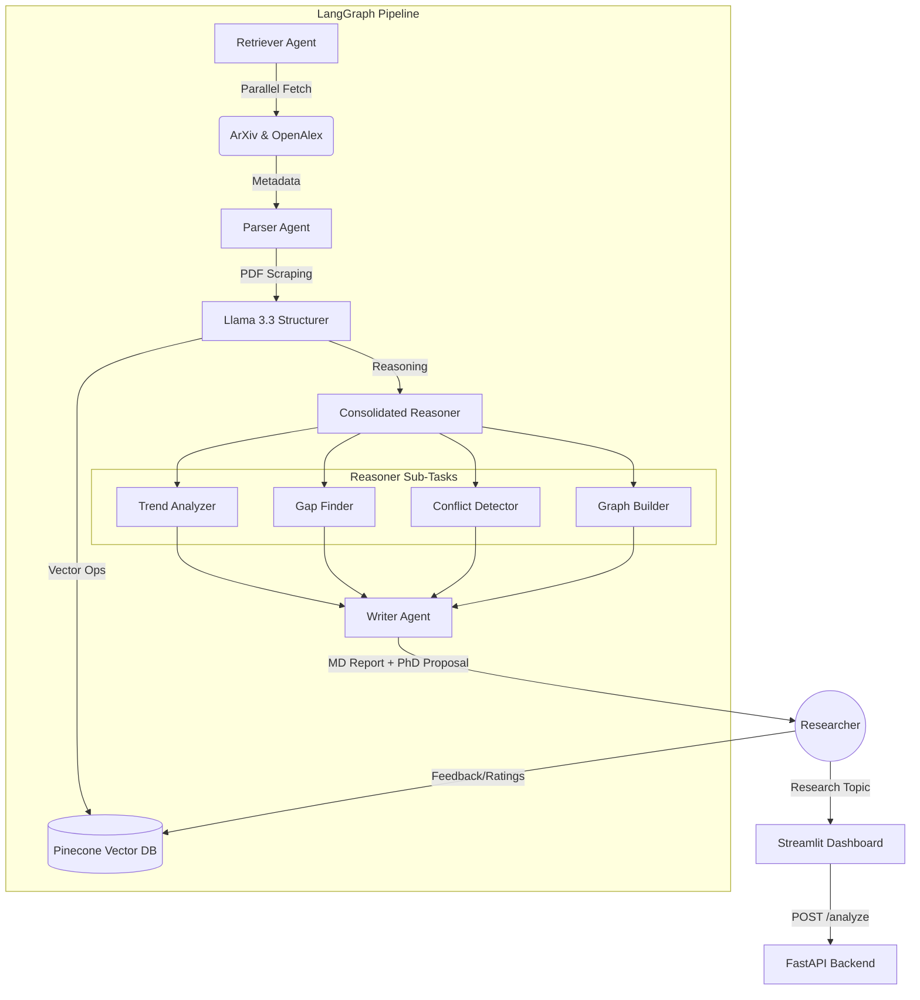

# Multi-Agent AI Research & Literature Synthesis System

[](https://www.python.org/)
[](https://fastapi.tiangolo.com/)
[](https://github.com/langchain-ai/langgraph)
[](https://groq.com/)

An autonomous, multi-agent platform designed to revolutionize academic research. By orchestrating specialized AI agents, this system moves beyond simple summaries to **discover research gaps**, flag **cross-study contradictions**, and synthesize **PhD-grade literature reviews (RRL)**.

---

## System Preview

The system features a premium, minimalist dashboard inspired by "AI Second Brain" aesthetics, providing:
- **Intelligence Suite**: Parallel analysis of trends, gaps, and conflicts.
- **Relational Knowledge Graph**: Interactive visualization of paper connections.
- **Self-Improving Loop**: Learns from user feedback to refine future retrieval.
- **Live Activity Logs**: Real-time terminal tracing of agent reasoning.

---

## System Architecture

The project utilizes a **Cyclic Multi-Agent Orchestration** built on LangGraph.



---

## Key Features

### 1. Parallel Intelligence Retrieval
Utilizes `asyncio` to fetch papers from **ArXiv** and **OpenAlex** simultaneously. It biopsies metadata and biases results towards topics you've previously rated highly in the **Self-Improving Loop**.

### 2. Autonomous Agentic Reasoning
- **Trend Analyzer**: Traces the evolution of methodologies over decades.
- **Gap Finder**: Identifies what *hasn't* been done (Missing approaches, repeated limitations).
- **Contradiction Finder**: Cross-references studies to find where researchers disagree.
- **Writer Agent**: Synthesizes a formal Literature Review and a structured Research Proposal.

### 3. Smart PDF Parsing (Multi-Modal Aware)
Automatically downloads PDFs from journals (MDPI, Wiley, etc.) and uses **Llama 3.3 70B** to extract structured JSON data: methodologies, datasets, findings, and limitations.

### 4. Relational Knowledge Graph
Generates a NetworkX graph converted to Graphviz format, visualizing how different papers interact through shared methodology and datasets.

---

## Technical Stack

- **Orchestration**: `LangChain` & `LangGraph`
- **Generative AI**: `Groq API` (Llama 3.3 70B & Llama 3.1 8B)
- **Vector Database**: `Pinecone` (Serverless)
- **Backend**: `FastAPI` (Asynchronous Python)
- **Frontend**: `Streamlit` (Premium Custom CSS)
- **Data Sources**: ArXiv API & OpenAlex API
- **Embeddings**: `sentence-transformers` (all-MiniLM-L6-v2)

---

## Project Structure

```text
Multi-Agent-RRL/
├── backend/
│   ├── agents/          # Specialized AI Agents (Retriever, Parser, etc.)
│   ├── app/             # FastAPI entry points and config
│   ├── services/        # Pinecone & Embedding integrations
│   ├── tools/           # PDF parsers and external toolkits
│   ├── utils/           # LLM utilities (Groq Async Client)
│   └── workflows/       # LangGraph DAG definitions
├── frontend/
│   └── app.py           # Premium Streamlit UI
├── requirements.txt     # Dependency management
└── .env                 # API Keys (Groq, Pinecone)
```

---

## Setup & Installation

### 1. Clone & Environment
```bash
git clone https://github.com/Hartz-byte/Multi-Agent-RRL.git
cd Multi-Agent-RRL
python -m venv venv
source venv/bin/activate  # venv\Scripts\activate on Windows
```

### 2. Install Dependencies
```bash
pip install -r requirements.txt
```

### 3. Configure Environment Variables
Create a `.env` file in the root:
```env
GROQ_API_KEY=your_key_here
PINECONE_API_KEY=your_key_here
PINECONE_INDEX=rrl-index
OPENALEX_EMAIL=your_email@example.com
```

### 4. Run the Platform
**Start Backend:**
```bash
uvicorn backend.app.main:app --host 0.0.0.0 --port 10000 --reload
```

**Start Frontend:**
```bash
streamlit run frontend/app.py
```

---

## License
Distributed under the MIT License. See `LICENSE` for more information.

## ⭐ Support
If this project helped your research, give it a star!

---
*Built for the Research Community.*
